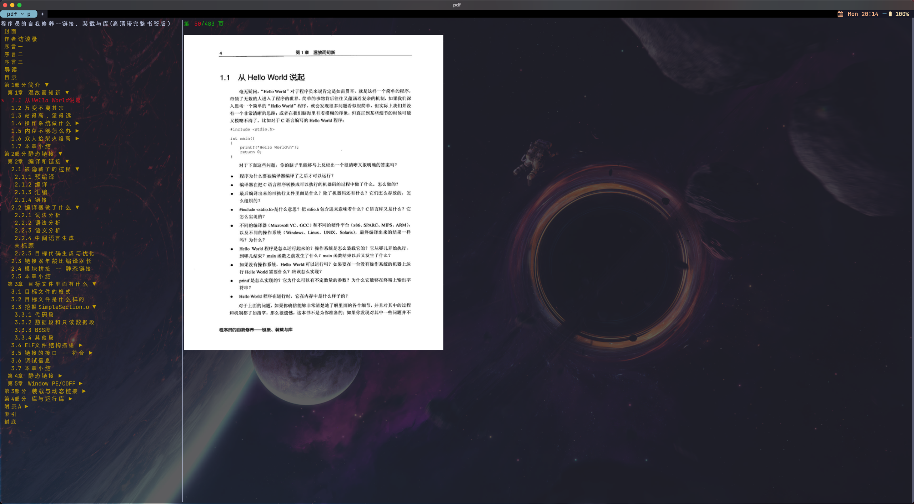

# Pdf Terminal Reader

read pdf file in terminal which support iterm2 image protocol

type **.** to jump specified page

type **w/s** to toggle left side bookmark  
type **⬆️/⬇️** to toggle right side pdf page